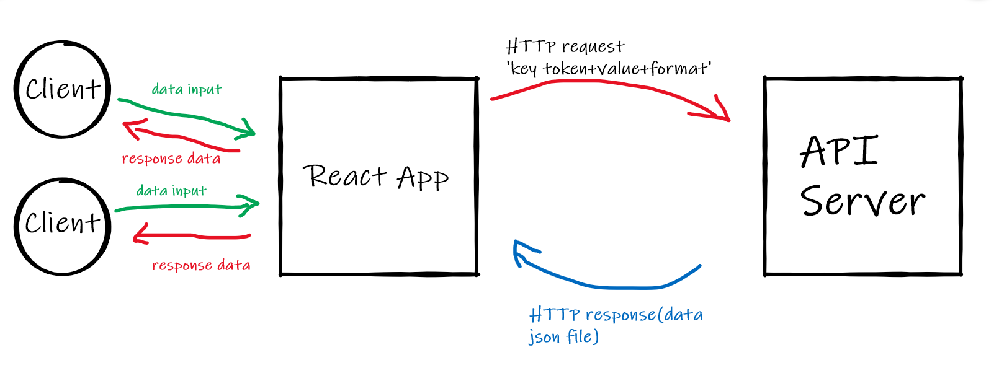

# Getting Started with Create React App

This project was bootstrapped with [Create React App](https://github.com/facebook/create-react-app).

## Available Scripts

In the project directory, you can run:

### `npm start`

Runs the app in the development mode.\
Open [http://localhost:3000](http://localhost:3000) to view it in the browser.

The page will reload if you make edits.\
You will also see any lint errors in the console.

### `npm test`

Launches the test runner in the interactive watch mode.\
See the section about [running tests](https://facebook.github.io/create-react-app/docs/running-tests) for more information.

### `npm run build`

Builds the app for production to the `build` folder.\
It correctly bundles React in production mode and optimizes the build for the best performance.

The build is minified and the filenames include the hashes.\
Your app is ready to be deployed!

See the section about [deployment](https://facebook.github.io/create-react-app/docs/deployment) for more information.

### `npm run eject`

**Note: this is a one-way operation. Once you `eject`, you can’t go back!**

If you aren’t satisfied with the build tool and configuration choices, you can `eject` at any time. This command will remove the single build dependency from your project.

Instead, it will copy all the configuration files and the transitive dependencies (webpack, Babel, ESLint, etc) right into your project so you have full control over them. All of the commands except `eject` will still work, but they will point to the copied scripts so you can tweak them. At this point you’re on your own.

You don’t have to ever use `eject`. The curated feature set is suitable for small and middle deployments, and you shouldn’t feel obligated to use this feature. However we understand that this tool wouldn’t be useful if you couldn’t customize it when you are ready for it.

## Learn More

You can learn more in the [Create React App documentation](https://facebook.github.io/create-react-app/docs/getting-started).

To learn React, check out the [React documentation](https://reactjs.org/).

### Code Splitting

This section has moved here: [https://facebook.github.io/create-react-app/docs/code-splitting](https://facebook.github.io/create-react-app/docs/code-splitting)

### Analyzing the Bundle Size

This section has moved here: [https://facebook.github.io/create-react-app/docs/analyzing-the-bundle-size](https://facebook.github.io/create-react-app/docs/analyzing-the-bundle-size)

### Making a Progressive Web App

This section has moved here: [https://facebook.github.io/create-react-app/docs/making-a-progressive-web-app](https://facebook.github.io/create-react-app/docs/making-a-progressive-web-app)

### Advanced Configuration

This section has moved here: [https://facebook.github.io/create-react-app/docs/advanced-configuration](https://facebook.github.io/create-react-app/docs/advanced-configuration)

### Deployment

This section has moved here: [https://facebook.github.io/create-react-app/docs/deployment](https://facebook.github.io/create-react-app/docs/deployment)

### `npm run build` fails to minify

This section has moved here: [https://facebook.github.io/create-react-app/docs/troubleshooting#npm-run-build-fails-to-minify](https://facebook.github.io/create-react-app/docs/troubleshooting#npm-run-build-fails-to-minify)

# City_Explorer

**Author**: Doa'a Daban
**Version**: 1.0.0 (increment the patch/fix version number if you make more commits past your first submission)

## Overview
This application for getting the map location for any contry worldwide.
Problrm domain:
To connect our react app with locationIQ API in order to get the location of any city.

## Getting Started
<!-- What are the steps that a user must take in order to build this app on their own machine and get it running? -->
The steps:
first of all, the user have to connect his repo with hid react app, and carefully read the documentaion for LocationIQ api, and get the url (http request), then send the http request for the Location Api server in order to get the response via axios library, and the user have to change the key and the params.

## Architecture
<!-- Provide a detailed description of the application design. What technologies (languages, libraries, etc) you're using, and any other relevant design information. -->
I used JS,CSS,HTML, locationIQ API, AXIOS library.

## Change Log
<!-- Use this area to document the iterative changes made to your application as each feature is successfully implemented. Use time stamps. Here's an example:

01-01-2001 4:59pm - Application now has a fully-functional express server, with a GET route for the location resource. -->

 8-2-2021 1:15am-Application now has a fully-functional express server, with a GET route for the location resource.

## Credit and Collaborations
<!-- Give credit (and a link) to other people or resources that helped you build this application. -->
1- [LocationIQ](https://locationiq.com/)

2- [AXIOS library](https://www.npmjs.com/package/axios)

## web request-response cycle diagram

Name of feature: __________LocationIQ API______________________

Estimate of time needed to complete: __5h___

Start time: __2h___

Finish time: __1:20AM___

Actual time needed to complete: _8h____

my deployed link >>
city-exp-app.netlify.app

.env content :

REACT_APP_KEY = pk.e997da4c61621084f545d56f650156b1

REACT_APP_SERVER_URL = http://localhost:3001

img_url=https://image.tmdb.org/t/p/w500